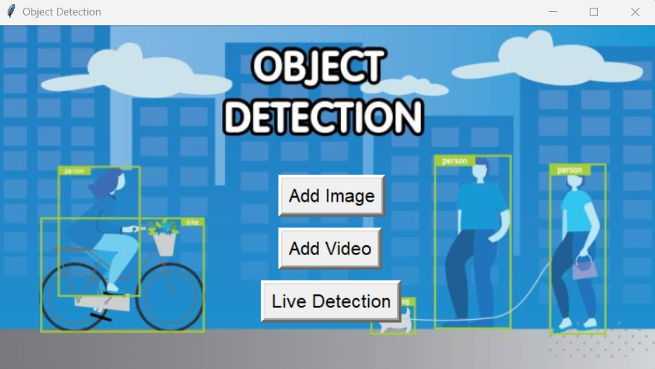
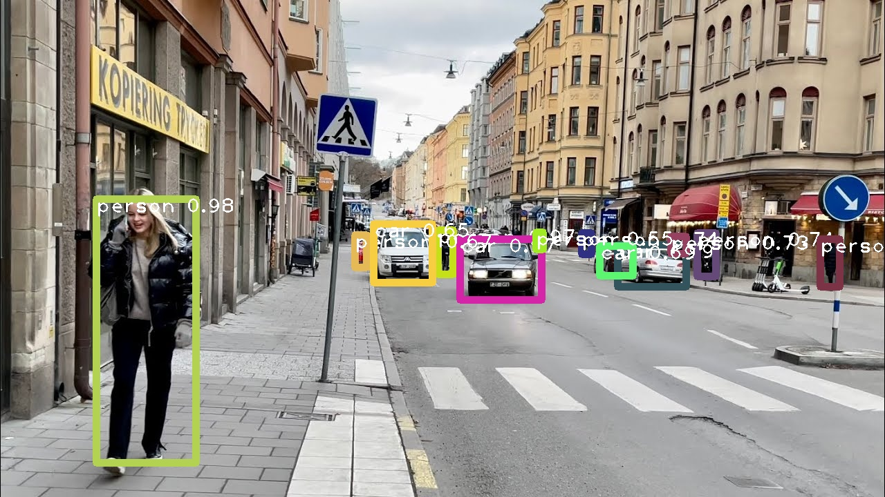
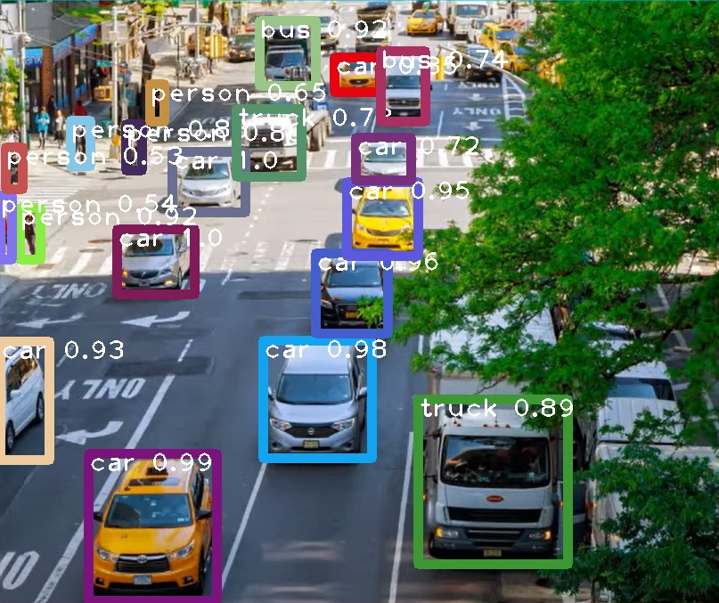
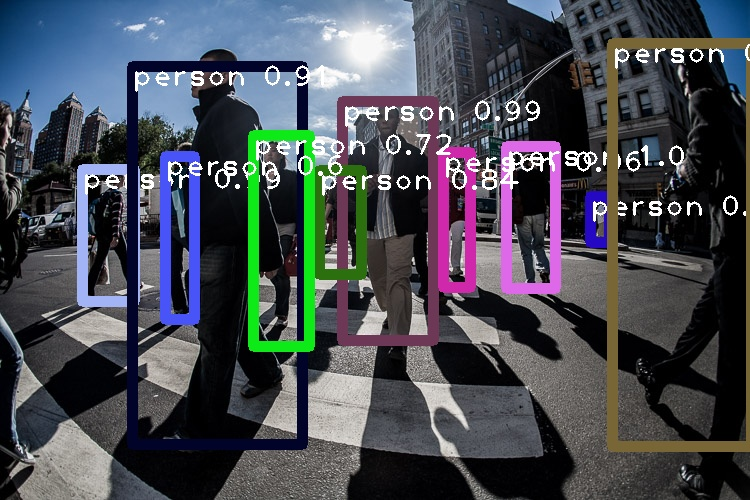
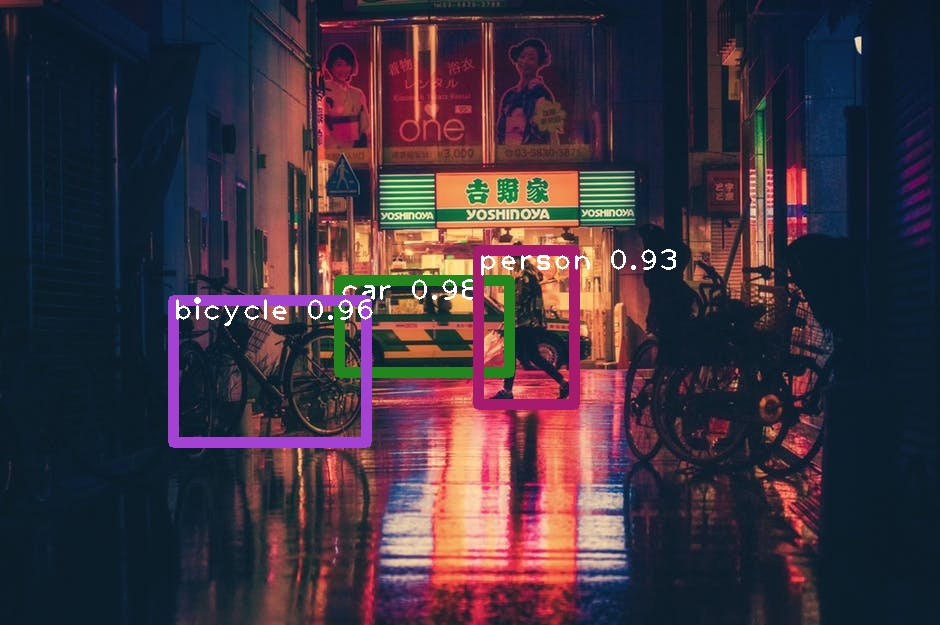

# Object Detection using YOLOv3

## Introduction
This project implements object detection using YOLOv3 with pre-trained weights. It supports live detection from a webcam, image detection, and video detection. The application is built using Python with libraries such as OpenCV, PIL, and Tkinter for the GUI, and runs primarily through a Jupyter Notebook interface.

## Features
- **Live Detection**: Real-time object detection using a webcam.
- **Image Detection**: Detect objects in images.
- **Video Detection**: Detect objects in video files.
- **Save Results**: Save the processed images and videos with detected objects.

## Technologies Used
- **Python**: Core programming language.
- **OpenCV**: For image and video processing.
- **PIL (Pillow)**: For image handling.
- **Tkinter**: For the graphical user interface.
- **YOLOv3**: Object detection model.
- **Jupyter Notebook**: For running and displaying the main code.

## Installation
1. **Clone the repository**:
   ```bash
   git clone https://github.com/yourusername/object-detection-yolov3.git
   cd object-detection-yolov3
   ```
2. **Install dependencies**:
- Make sure you have Python installed. Then, install the required libraries:
   ```bash
   pip install numpy opencv-python pillow matplotlib jupyter
   ```
3. Download YOLOv3 weights and configuration:

- Download the YOLOv3 weights from the official source. (https://pjreddie.com/darknet/yolo/)
- Download the yolov3.cfg and coco.names files. (already present in repository)

4. Set up the project:

- Place yolov3.weights, yolov3.cfg, and coco.names in the project directory.

## Usage

1. **Run Jupyter Notebook**:

  ```bash
  jupyter notebook
  ```
Open the object_detection.ipynb notebook.

2. **Live Detection**:

- Click on live detection to start real-time object detection using your webcam.

3. **Image Detection**:

- Click on image detection, select an image file, and the application will detect objects in the image.

4. **Video Detection**:

- Click on video detection and the application will detect objects in the video.

## Screenshots






